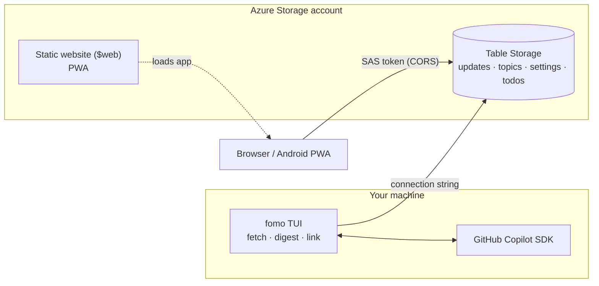

# 📰 FOMO

**Fear Of Missing Out** — a release & update tracker for developer tools.
Track GitHub releases, Azure updates, VS Code changelogs, Copilot CLI versions and tech news in one place,
with a **GitHub Copilot digest** that folds related updates into one topic with a few highlights.

One storage account · No servers · Two interfaces (terminal UI + installable web app)

---

## Table of Contents

- [Architecture](#architecture)
- [Copilot Digest](#copilot-digest)
- [Installation](#installation)
  - [Azure Deployment](#azure-deployment)
  - [TUI Setup](#tui-setup)
  - [Connect the Web App](#connect-the-web-app)
  - [Install on Android](#install-on-android)
  - [Local Development](#local-development)
  - [Migrating from Container Apps](#migrating-from-container-apps)
- [Using the Web App](#using-the-web-app)
- [Using the TUI](#using-the-tui)
  - [Keys](#keys)
  - [Config Screen](#config-screen)
  - [Backup & Restore](#backup--restore)
- [Sources](#sources)
- [Security](#security)
- [Environment Variables](#environment-variables)
- [CI/CD](#cicd)
- [Storage](#storage)
- [License](#license)

---

## Architecture



```
packages/
  core/     Shared types · Azure Table stores · scrapers · digest engine · services
  web/      React/Vite PWA — static files, talks to Table Storage directly
  tui/      Ink terminal UI (`fomo`) — setup, fetch, Copilot digest, device links, backups
```

- **No compute in Azure.** Everything lives in one Storage Account: Table Storage for data and the static website for the web app.
- **Fetch and digest run in the TUI** (`fomo`, then `f`) on your machine, using your GitHub Copilot subscription.
- **The web app is static.** It reads and writes Table Storage from the browser with a SAS token handed over by the TUI's **Link a device** action (magic link / QR code).
- **No command-line arguments.** `fomo` opens the TUI; everything else (setup, config, links, backups) is done from inside it.

---

## Copilot Digest

Instead of reading 200 separate updates, the **Digest** view (the default, key `0`) shows one line per product area,
usually 20–30 topics:

```
▸ ▲ Copilot CLI releases                          6   github, github-blog   2h ago
▸ Copilot code review                             9   github                5h ago
▸ Azure networking                                5   azure                 1d ago
▸ Azure retirements                               4   azure                 1d ago
```

Open a topic to see a one-sentence summary and up to six highlights (most important first). Each update in the topic also gets its own one-line summary, so you can decide which ones to open.
A topic with only one update doesn't expand: its row shows that update's title and summary directly, and `Enter` opens the update.
Mark the whole topic read with `x`, which makes skipping a low-value area a single key press.

**Grouping.** Each topic is one **product or feature area**, such as "Copilot code review", "GitHub Actions", "VS Code releases", "Azure SRE Agent" or "Anthropic news":

- Topics usually hold 3–15 updates. A new topic with more than 15 gets a second call that splits it into narrower areas.
- There are no catch-all topics such as "Azure updates" or "Misc".
- Deprecations and retirements go into one topic per vendor ("Azure retirements"). Titles that mention a retirement or deprecation are flagged to the model.
- Releases of one product stay together. Items whose titles differ only in version numbers are flagged to the model as a release series.
- General essays go into one topic per source ("GitHub blog essays").
- New products and major launches get their own topic so they aren't buried.

**Importance.** Each topic is rated so you can tell what's worth reading:

| Level  | Shown as                        | Typical updates |
|--------|---------------------------------|-----------------|
| High   | `▲` (orange) · sorted first     | New products, major versions or revamps, big features in widely used tools, flagship models |
| Medium | normal                          | Notable features, previews reaching GA, releases with real changes, breaking changes that hit common setups soon |
| Low    | dimmed · sorted last            | Patches, regions, admin settings, SKUs, distant deprecations, research, partnerships, surveys, marketing |

Deprecations and protocol changes (such as an SSH algorithm) are never rated high. The digest is sorted by importance, then newest first.

To steer the rating toward what you care about, add an optional interests note (`c` → **Interests**), for example
`Copilot CLI and agents, VS Code; not SAP or billing`. It moves a topic up or down by at most one level and never changes the grouping.
Save an empty value to clear it.

How it works:

- `f` in the TUI fetches the sources and then runs the digest. Turn **Group after fetch** off in the config screen to fetch only.
- Only **unread updates that don't have a topic yet** are sent to Copilot, in two passes:
  1. **Plan:** one call sees every pending update (title and a short excerpt) plus the currently open topics. It assigns each update to an existing or new topic and rates it. Updates the model skips get one more call; oversized new topics get a split call.
  2. **Write:** one small call per touched topic writes the summary, the highlights and a one-sentence summary of each new update. These run 6 at a time with low reasoning effort, and a failed call is retried once.
- Topics are stored in the `topics` table, and each update points to its topic (`topicId`), so the web app and TUI only read.
- Updates that haven't been digested yet still appear in the digest as single-item entries.
- About 220 updates take roughly 2 minutes. **Max items per run** (default 300) caps a run; the rest are grouped next time.
- The default model is `gpt-5-mini`. Change it with **Copilot model** in the config screen or `FOMO_COPILOT_MODEL`.
- Existing topics keep their grouping and rating. **Regroup all topics** in the config screen regroups and re-rates all unread updates (read and saved status is untouched). This also fills in per-update summaries for updates digested before they existed.
- Authentication uses your logged-in Copilot CLI user, or `COPILOT_GITHUB_TOKEN` / `GH_TOKEN` / `GITHUB_TOKEN`.

---

## Installation

### Azure Deployment

**Prerequisites:** Azure CLI (`az login`), `jq`, Node.js 22+ and pnpm.

```bash
pnpm install
bash deploy.sh fomo swedencentral        # add -y to skip the what-if prompt
```

The script:

1. Builds the web app.
2. Deploys `infra/main.bicep`: one Storage Account with the `updates`, `topics`, `settings` and `todos` tables, plus Table Storage CORS for the static website origin (and `localhost:5173`/`4173` for dev).
3. Enables the static website and uploads the PWA to `$web`.
4. Prints the web app URL and the next steps.

### TUI Setup

```bash
pnpm --filter @fomo/tui... build
node packages/tui/dist/index.js      # or put `fomo` on your PATH: (cd packages/tui && npm link)
```

The first time, `fomo` asks for the storage connection string. Get it with:

```bash
az storage account show-connection-string -g fomo -n <account> -o tsv
```

Paste it and press `Enter`; FOMO checks the connection and saves it to `~/.fomo/config.json`.
Then press `c` and set **Web app URL** (printed by `deploy.sh`, e.g. `https://<account>.z1.web.core.windows.net/`).

The digest needs GitHub Copilot. If you use the Copilot CLI, you're already signed in; otherwise export `COPILOT_GITHUB_TOKEN`.
Press `f` to fetch all sources and build the digest.

### Connect the Web App

In the TUI press `c` → **Link a device**. It shows a magic link and a QR code; `o` opens the link, `y` copies it.
Links are valid for 365 days; change **Link valid (days)** in the config screen for shorter-lived links.

Open the link (or scan the QR code with your phone). It carries a Table Storage SAS token in the URL
fragment (`#…`), which is never sent to any server. The web app saves it in the browser and removes it from the address bar.
You can also paste the link into the app's connect screen.

The status bar warns you when the token has 14 days or less left. Create a new link to renew it. **Disconnect** removes the token from that browser.

### Install on Android

1. Open the magic link in **Chrome** on your phone. Scanning the QR code from **Link a device** works well.
2. Tap **⋮ → Add to Home screen → Install**.

FOMO then runs full-screen from your home screen like a native app. The app shell works offline, and data loads from Table Storage when you're online. Pull down on the list to refresh.
On iOS, use Safari → Share → **Add to Home Screen**.

### Local Development

```bash
pnpm install
pnpm build
pnpm test

# Local storage emulator (optional)
npx azurite --silent --location /tmp/azurite &
az storage cors add --services t --origins http://localhost:5173 http://localhost:4173 \
  --methods GET HEAD POST PUT PATCH MERGE DELETE OPTIONS --allowed-headers '*' --exposed-headers '*' \
  --connection-string "UseDevelopmentStorage=true"

# Web app dev server
pnpm --filter @fomo/web dev

# TUI against Azurite: paste UseDevelopmentStorage=true at setup (or set it under c → Connection string),
# set Web app URL to http://localhost:5173/, press f, then c → Link a device to connect the dev server.
fomo
```

With Azurite, **Link a device** creates a SAS token that also allows `http`. The `az storage cors add` command lets the browser call Azurite from the dev server; it mirrors the CORS rule that Bicep sets in Azure.

### Migrating from Container Apps

Earlier versions ran a Hono server and an hourly scraper job on Azure Container Apps with Google sign-in. The Storage Account and your data stay the same.

1. Run `bash deploy.sh fomo swedencentral --cleanup-legacy`. This deploys the static site and deletes `fomo-app`, `fomo-scraper`, `fomo-env`, `fomo-env-logs` and the Container Registry.
2. Run `fomo`, press `c`, set **Web app URL** to the printed URL, then choose **Link a device**.
3. Choose **Regroup all topics** once to group your existing unread updates.
4. Remove the old secrets (`GOOGLE_CLIENT_ID`, `GOOGLE_CLIENT_SECRET`, `SESSION_SECRET`, `ALLOWED_USERS`) from GitHub and your `.env`, and delete the Google OAuth client.

---

## Using the Web App

The web app mirrors the TUI: the same dark text UI and the same keys. On a phone, tap rows, use the action bar, and pull to refresh.

| Key             | Action                                    |
|-----------------|-------------------------------------------|
| `0`             | Digest: unread updates grouped by topic   |
| `1` `2` `3` `4` | Filter: All / Unread / Read / Saved       |
| `5` / `t`       | Todos                                     |
| `j` / `↓`       | Next row                                  |
| `k` / `↑`       | Previous row                              |
| `Enter`         | Digest: expand topic · Lists: toggle detail |
| `→` / `l`, `←`  | Digest: expand / collapse topic           |
| `x`             | Mark read (the whole topic in the digest) & next |
| `r` / `u`       | Mark read / unread                        |
| `n`             | Next topic / next unread                  |
| `s`             | Save / unsave                             |
| `o`             | Open URL in a new tab                     |
| `.`             | Toggle preview position (right / bottom)  |
| `c`             | Config                                    |
| `h`             | Help                                      |

Fetching isn't done in the browser. Run `fomo` on your computer and press `f`, then pull to refresh.

---

## Using the TUI

Run `fomo`. It opens on the **Digest**. There are no subcommands: `fomo --help` and `fomo --version` are the only flags.

### Keys

| Key             | Action                                    |
|-----------------|-------------------------------------------|
| `0`             | Digest: unread grouped by topic           |
| `1`–`4`         | Filter: All / Unread / Read / Saved       |
| `j`/`↓`, `k`/`↑`| Move                                      |
| `Enter`         | Expand topic and open it / toggle detail  |
| `→`/`l`, `←`    | Expand / collapse topic                   |
| `x` / `r`       | Mark topic (or update) read & next        |
| `u`             | Mark unread (lists)                       |
| `n`             | Next topic / next unread                  |
| `s`             | Save / unsave                             |
| `o`             | Open in browser (newest update of a topic)|
| `p`             | Fetch full content (detail view)          |
| `f` / `F`       | Fetch latest updates + Copilot digest     |
| `c`             | Config: sources, link a device, backup / restore, local settings |
| `t`             | Todos (`a` add, `Enter` cycle status, `d` delete) |
| `Esc`           | Clear the source filter                   |
| `.`             | Toggle preview position                   |
| `h`             | Help                                      |
| `q`             | Quit                                      |

The status bar shows counts by status; the config screen shows counts per source.

### Config Screen

Press `c`. The bottom line shows the keys for the selected row.

| Section | Row | Keys |
|---------|-----|------|
| **Actions** | Link a device | `Enter`: magic link + QR code for the web app (`o` open, `y` copy) |
| | Regroup all topics | `Enter` twice: rerun the Copilot digest on every unread update |
| | Back up updates / Restore from backup | See [Backup & Restore](#backup--restore) |
| **Sources** (shared with the web app) | One row per source, with its item count and last fetch result | `Enter` enable/disable · `e` label · `d` color · `f` fetch just this source (even if disabled) · `v` list only its updates |
| **Display** (shared) | Preview position | `Enter` cycles right / bottom / off |
| **This computer** (`~/.fomo/config.json`) | Connection string, Web app URL, Copilot model, Interests, Group after fetch, Max items per run, Link valid (days), Backup folder | `Enter` edits (toggles for Group after fetch). Save an empty value to restore the default. Values set by an environment variable are tagged `[env]`. |

### Backup & Restore

**Back up updates** writes every update from Table Storage to `fomo-backup-<timestamp>.json` in the backup folder
(default `~/.fomo/backups`, change it under **Backup folder**).

**Restore from backup** lists the `.json` files in the backup folder, newest first. Pick one and press `Enter` twice.
Entities are upserted, so this is safe for both fresh and incremental restores; nothing is deleted.

The backup format is `{ version: 1, exportedAt, count, entities: [...] }`.

---

## Sources

### Built-in Sources

| Source | ID | What it tracks |
|--------|----|----------------|
| GitHub | `github` | GitHub Releases (Node.js, TypeScript, etc.) |
| GitHub Blog | `github-blog` | GitHub Blog posts |
| Azure | `azure` | Azure Updates RSS feed |
| VS Code | `vscode` | VS Code releases (official Atom feed) |
| Copilot CLI | `copilot-cli` | GitHub Copilot CLI releases |
| The Register | `theregister` | The Register tech news (Atom feed) |
| Anthropic News | `anthropic-news` | Anthropic news |
| Anthropic Engineering | `anthropic-engineering` | Anthropic engineering blog |
| Azure SRE Agent | `azure-sre-agent` | Azure SRE Agent updates |
| GitHub Next | `github-next` | GitHub Next research & prototypes (RSS) |

### Adding a New Source

Create a source plugin in two files:

**1. Create the plugin** (`packages/core/src/scraper/sources/<name>.ts`):

```typescript
import type { SourcePlugin, ScrapedItem } from '../../types.js';

export const mySource: SourcePlugin = {
  id: 'mysource',
  displayName: 'My Source',
  capabilities: { preview: true },

  async fetch(): Promise<ScrapedItem[]> {
    try {
      const res = await fetch('https://example.com/feed', {
        headers: { 'User-Agent': 'fomo-release-tracker/1.0' },
        signal: AbortSignal.timeout(15_000),
      });
      if (!res.ok) throw new Error(`HTTP ${res.status}`);
      const data = await res.json();
      return data.items.map((item: any) => ({
        title: item.title,
        url: item.url,
        datePublished: new Date(item.publishedAt),
        content: item.summary ?? '',
      }));
    } catch (err) {
      console.error('[mysource] fetch failed:', err instanceof Error ? err.message : err);
      return [];
    }
  },
};
```

**2. Register it** in `packages/core/src/scraper/registry.ts`:

```typescript
import { mySource } from './sources/mysource.js';

const builtins: SourcePlugin[] = [
  githubSource, azureSource, vscodeSource, copilotCliSource,
  mySource,       // ← add here
];
```

**3. Build and test:**

```bash
pnpm build
fomo      # press c, select your source and press f to fetch just it
```

The source is automatically available in the TUI, the digest, and the web app.

See [EXTENDING.md](EXTENDING.md) for more patterns (RSS/Atom feeds, GitHub Releases API).

---

## Security

- **TUI:** uses the storage connection string (account key). Keep `~/.fomo/config.json` private (it is created with mode `600`).
- **Web app:** uses an **account SAS token** limited to the Table service and entity operations (`ss=t`, `srt=o`, `sp=raud`), HTTPS only, and valid for **Link valid (days)** (default 365).
  - It can read and update your FOMO tables, but it cannot create or delete tables or touch blobs.
  - It is delivered in the URL fragment, so it never reaches a web server or logs, and it is stored in the browser's `localStorage`.
- **Revoke every link:** rotate the storage key that signed it (**Link a device** signs with the key in your connection string, usually `key1`):
  ```bash
  az storage account keys renew -g fomo -n <account> --key key1
  ```
  Then set the new connection string in the TUI (`c` → **Connection string**) and link your devices again.
- **CORS:** Table Storage only accepts browser calls from the static website origin (and localhost dev ports). Add custom domains with the `extraCorsOrigins` Bicep parameter.
- The static website itself is public, but it contains no data.

---

## Environment Variables

All are optional. The TUI config screen (`c` → **This computer**) stores the same values in `~/.fomo/config.json`.

| Variable                          | Description                                                  |
|-----------------------------------|--------------------------------------------------------------|
| `AZURE_STORAGE_CONNECTION_STRING` | Connection string (fallback when the config file has none)   |
| `FOMO_WEB_URL`                    | Web app URL for **Link a device** (overrides config)         |
| `FOMO_COPILOT_MODEL`              | Copilot model for the digest (overrides config)              |
| `FOMO_INTERESTS`                  | Interests note for digest importance (overrides config)      |
| `COPILOT_GITHUB_TOKEN` / `GH_TOKEN` / `GITHUB_TOKEN` | Token for the Copilot SDK (default: logged-in Copilot CLI user) |

---

## CI/CD

The GitHub Actions workflow (`.github/workflows/deploy.yml`) builds and tests every push to `main`, then runs `deploy.sh` to update the storage account and static website.
It signs in to Azure with OIDC (Workload Identity Federation), so it needs no Azure secrets beyond these IDs:

| Secret                  | Value                                   |
|-------------------------|-----------------------------------------|
| `AZURE_CLIENT_ID`       | Client ID of the federated identity     |
| `AZURE_TENANT_ID`       | Tenant ID                               |
| `AZURE_SUBSCRIPTION_ID` | Subscription ID                         |

The identity needs **Contributor** on the resource group. `deploy.sh` lists the storage key to upload the site.
See [docs/workload-identity-federation.md](docs/workload-identity-federation.md) for the setup.

Fetching isn't scheduled in CI. Run `fomo` and press `f` whenever you want fresh updates.

---

## Storage

| Table      | PartitionKey                       | RowKey                       | Contents                              |
|------------|------------------------------------|------------------------------|---------------------------------------|
| `updates`  | Source ID (e.g. `azure`, `github`) | `sha256(url).slice(0, 32)`   | Updates, status, saved, `topicId`, Copilot `summary` |
| `topics`   | `topic`                            | Topic id                     | Copilot title, summary, highlights    |
| `settings` | —                                  | —                            | Shared UI/source settings             |
| `todos`    | —                                  | —                            | Personal todos                        |

Status updates use ETag-based optimistic concurrency.

---

## License

MIT
